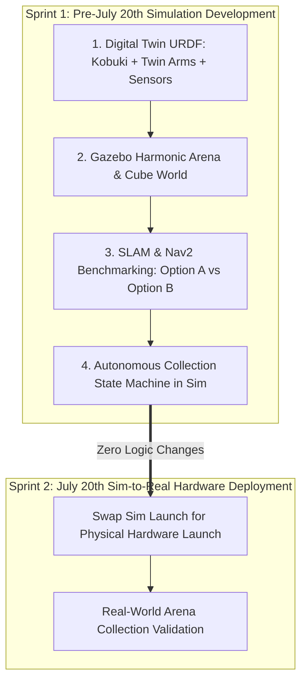

# BotZilla — Phase 1 Implementation Plan & Sim-to-Real Roadmap

-00a86b?style=for-the-badge)
-76B900?style=for-the-badge)
-ff6b35?style=for-the-badge)

---

## 1. Executive Summary & Sim-to-Real Strategy

Between **now and July 20th**, physical hardware access is unavailable. We turn this constraint into an advantage by developing **100% of the autonomous stack in Gazebo Harmonic (`ros-gz`)** on ROS 2 Jazzy.

Because ROS 2 utilizes standardized topic and message interfaces (`sensor_msgs/msg/LaserScan`, `sensor_msgs/msg/Image`, `nav_msgs/msg/Odometry`), any mapping, pathfinding, or autonomous state machine code developed in simulation runs **unchanged on the physical Jetson Orin Nano Super** when hardware arrives on July 20th.

---

## 2. Architecture & Decision Protocol

| Component | Primary Option A (`rtabmap_ros`) | Fallback Option B (`slam_toolbox` + VoxelLayer) |
| :--- | :--- | :--- |
| **SLAM Engine** | Visual-Laser Odometry & Graph SLAM (`rtabmap_ros`) | 2D LiDAR Graph SLAM (`slam_toolbox`) |
| **Inputs Fused** | `/scan` + `/camera/rgb/image_raw` + `/camera/depth/image_raw` + `/odom` | `/scan` + `/odom` (for SLAM)   `/camera/depth/points` (for local obstacle avoidance) |
| **2D Map Output** | Projected 2D occupancy grid (`/map`) | Native 2D occupancy grid (`/map`) |
| **3D Obstacle Safety** | Handled natively inside 3D OctoMap projection | Handled via Nav2 `nav2_costmap_2d::VoxelLayer` |
| **Fallback Trigger Condition** | High frame drops, TF synchronization errors > 200ms, or excessive CPU thermal throttling during testing. | Immediate switch via launch file argument (`use_rtabmap:=false use_slam_toolbox:=true`). |

---

## 3. Sprint 1: Pre-July 20th Simulation Execution (Days 1–10)

### Milestone 1: Digital Twin URDF & Gazebo Physics World (`botzilla_description` & `botzilla_gazebo`)
*   **Create `botzilla_description` package**:
    *   XACRO model of the Kobuki QBot 2 differential drive chassis.
    *   **Twin Passive Collection Arms**: Front-facing funnel arms modeled with collision geometries so physical cube contact can be simulated.
    *   **Simulated Sensors**:
        *   2D LiDAR (`ray` sensor) publishing clean `/scan`.
        *   RGB-D Kinect (`rgbd_camera` sensor) publishing `/camera/rgb/image_raw`, `/camera/depth/image_raw`, and `/camera/depth/points`.
*   **Create `botzilla_gazebo` package**:
    *   Enclosed indoor arena with perimeter walls and internal partitions.
    *   Scattered collectible cubes (target objects with distinct colors/masses).
    *   Low obstacles to verify 3D Voxel Layer collision prevention.

### Milestone 2: Option A & Option B SLAM Validation in Gazebo (`botzilla_slam`)
*   Launch simulated robot inside Gazebo Harmonic.
*   **Test Option A (`rtabmap_ros`)**: Verify synchronized visual-laser loop closure and 3D OctoMap generation across the arena.
*   **Test Option B (`slam_toolbox` + `VoxelLayer`)**: Verify 2D laser mapping and ensure Nav2 local costmap flags 3D depth obstacles that lie below the LiDAR plane.
*   Configure custom footprint padding (`footprint: [[x,y], ...]`) around the twin front collection arms so Nav2 never clips doorways.

### Milestone 3: Autonomous Cube Search & Collection State Machine (`botzilla_executor`)
*   Build Python/C++ Behavior Tree / State Machine node:
    1.  **FRONTIER EXPLORATION**: Navigate unmapped arena until target cube is detected.
    2.  **TARGET ALIGNMENT**: Steer robot so the target cube aligns precisely between the twin passive arms.
    3.  **CUBE CAPTURE & FUNNELING**: Drive forward to physically trap the cube between the arms.
    4.  **DELIVERY TO ORIGIN**: Command Nav2 to drive back to drop-off origin $(0,0)$ and back away to release.

---

## 4. Sprint 2: July 20th Sim-to-Real Hardware Deployment

When physical hardware becomes available on **July 20th**:
1.  **Driver Bridge Deployment**: Launch `botzilla_bringup/launch/hardware.launch.py` connecting physical Kobuki driver, Kinect C++ driver, and 2D LiDAR.
2.  **Zero-Code Switch**: Switch `use_sim_time:=false`. SLAM, Nav2, and the Collection State Machine run identical ROS 2 nodes.
3.  **Real-World Arena Trials**: Measure physical collection speed, drop-off accuracy (< 15cm error), and sensor fusion robustness.
