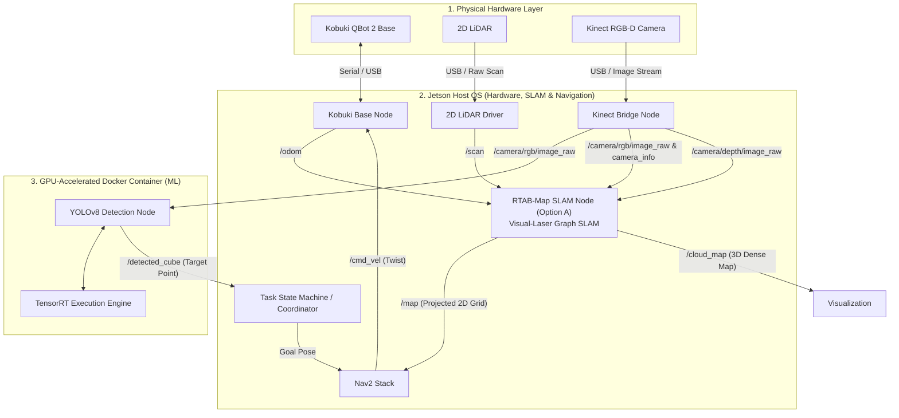

# Week 2 Progress Report: Simulation & Architecture Decisions

This document summarizes the development progress, system configurations, and architectural decisions completed during Week 2 of the Semester 5 Autonomous Multi-Cube Search & Collection Robot project.

---

## 1. Accomplishments & System Upgrades

### A. Simulation Environment Upgrade (`botzilla_arena.world`)
Upgraded the Gazebo Harmonic SDF world from an empty 5x5m box to a realistic partitioned indoor environment to test true autonomous exploration and navigation:

* **Occlusion & Rooms**: Added central and side partition walls (`partition_central` and `partition_room_west`) creating distinct rooms, doorways, and hallways. The robot cannot see all cubes from the start and must explore.
* **$N = 4$ Collectible Cubes**: Scattered 4 dynamic target cubes (`cube_1` to `cube_4`) across different rooms with realistic masses and collision properties.
* **Multi-Height Obstacles**:
  * Added a normal pillar (`pillar_1`) visible to the 2D LiDAR.
  * Added a low floor barrier (`low_barrier_1`, 6cm high) below the LiDAR plane to validate Kinect 3D Voxel Layer obstacle avoidance.

### B. Hardware Launch File Upgrades (`hardware.launch.py`)
Optimized the real-world bring-up sequence for the Jetson Orin Nano Super:
* **Added TF Publishing**: Added `robot_state_publisher` loading `botzilla_qbot.urdf` so the real robot broadcasts its coordinate frames (`base_link -> camera_link` and `base_link -> laser_frame`) out of the box.
* **Removed Pi 5 Workaround**: Stripped the hardcoded Pi 5 `noreset.so` `LD_PRELOAD` hack since the Jetson's USB controllers do not require it.

### C. Portable Perception Node (`yolo_node.py`)
* Replaced the hardcoded user home path pointing to `Bozilla-ws/` with a dynamic relative path solver. The node now resolves `runs/best-fit/best.pt` automatically based on the active workspace layout.

---

## 2. Key Architecture Decisions

We evaluated two sensor fusion architectures for the system's 2D LiDAR + Kinect RGB-D camera:

| Architecture | Setup | Advantages | Role |
|---|---|---|---|
| **Option A (RTAB-Map)** | Visual-Laser Pose Graph SLAM | Real-time visual loop closure, immune to corridor laser drift, generates dense 3D colored maps. | **Primary SLAM & Mapping Engine** |
| **Option B (slam_toolbox + Voxel)** | 2D LiDAR SLAM + local Nav2 Voxel Layer | Extremely lightweight on CPU/GPU, modular tuning, decoupled navigation and vision. | **Fallback Engine** (Triggers on high thermal load or CPU bottlenecks) |

### Option A (Primary) System Architecture

---

## 3. Next Steps (Week 3 Preparation)
* Integrate `rtabmap_ros` launcher within the simulation workspace.
* Configure and tune the Nav2 local costmap parameters to inflate custom footprint bounds matching the twin passive capture arms.
* Run frontier exploration simulation tests to verify the robot can successfully explore the new multi-room layout and discover all 4 cubes.
